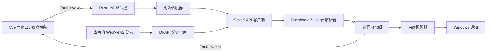

# SevnX Monitor 产品与技术规格

> 文档状态：需求冻结，可进入开发
>
> 项目目录：`E:\DeepSeekDesktopAssistant\sevnx`
>
> 目标平台：Windows 10 / Windows 11
>
> 产品名称：SevnX Monitor
>
> 最后更新：2026-07-17

## 1. 文档用途

本文档是 SevnX Monitor 的产品、交互、数据和技术实现基线。后续开发以本文档为准；旧原型、父项目和两个 RAW 项目只用于验证思路，不构成可复用代码源。

新对话继续开发时，应首先阅读本文档，再检查当前代码与 `git status`。若实现和本文档冲突，除非用户明确变更需求，否则以本文档为准。

## 2. 产品定义

SevnX Monitor 是一个独立的 Windows 桌面应用，用于快速查看 SevnX 账户状态、计价信息和聚合使用情况。它应比网页 Dashboard 更直接、响应更及时，同时保留打开官方 Dashboard 的入口，以便用户查看网页新增信息。

核心目标：

1. 在固定尺寸桌面窗口内清晰显示 SevnX Dashboard 的核心账户指标。
2. 显示 Token 趋势以及模型、分组、端点三个聚合分布。
3. 支持手动全量刷新和按窗口可见性自动刷新。
4. 支持低余额 Windows 通知。
5. 支持一个始终置顶、可吸附的精简横条。
6. 登录凭证按实际有效期安全保留，业务数据只保留在本次进程内。

## 3. 明确边界

### 3.1 包含范围

- 独立 Windows 桌面软件和安装包。
- Dashboard 与使用记录两个顶层页面。
- 应用内 WebView2 登录窗口。
- Rust 后端直接请求 SevnX 接口。
- Tauri IPC 内部通信，不开放本地 HTTP 服务。
- 托盘、吸附横条、主题、开机自启动和诊断功能。
- 中文界面。

### 3.2 不包含范围

- 不复用父项目或 RAW 项目的源代码。
- 不作为父项目顶层模块或子项目发布。
- 不支持 macOS、Linux、移动端。
- 不支持多语言。
- 不显示逐条请求或单次调用明细。
- 不提供 API 密钥管理，只显示数量和启用数量。
- 不在 Dashboard 显示模型分布。
- 不自行累计、推导或估算 Dashboard Token 与费用。
- 不持久化 Dashboard、趋势、分布或其他业务数据。
- 不读取系统默认浏览器的 Cookie 数据库。
- 不开放 localhost 端口，不保留现有 Node HTTP/SSE 原型架构。
- 不提供父项目式的多种小组件，只提供主窗口和一个吸附横条。

## 4. 软件结构与窗口

### 4.1 主窗口

- 固定逻辑尺寸：`400 x 780`，与父项目主窗口一致。
- 不允许用户调整尺寸。
- 主窗口不得暴露 Windows 原生标题栏、边框或默认阴影。Tauri 仅作为透明、无装饰的 WebView2 宿主；圆角、边界、顶部工具栏和窗口拖动区域均由前端自绘。
- 顶部仅空白拖动区可拖动；标签页和工具按钮必须保持可点击，不得被拖动手势劫持。
- 内容必须在固定尺寸内自动布局，页面主体可以纵向滚动。
- 左上角为两个浏览器标签页风格的小卡片按钮：`Dashboard`、`使用记录`。
- 右上角从左到右为：手动刷新、设置、关闭。
- Dashboard 与使用记录是全页切换，不同时展示。
- 点击关闭隐藏到托盘，不退出进程。
- 软件启动后默认显示主窗口。

### 4.2 使用记录子页面

使用记录内提供四个子页面按钮：

1. Token 趋势
2. 模型
3. 分组
4. 端点

四个子页面共享时间范围选择器。切换子页面不改变当前时间范围。

### 4.3 登录窗口

- 使用 Tauri 创建的独立 WebView2 窗口，不使用系统默认浏览器完成登录。
- 建议初始尺寸：`1180 x 860`，居中、置顶，可调整大小。
- 登录页：默认 `https://www.sevnx.lol/login?redirect=/dashboard`，站点根 URL 可在设置中自定义。
- WebView2 资料目录由应用显式指定，便于稳定读取 Cookie 和清理会话。
- 登录成功并通过接口验证后自动关闭登录窗口，主窗口切换到 Dashboard。
- 用户再次点击登录时，新凭证自然覆盖旧凭证，不提供单独“退出登录”按钮。
- 用户手动关闭登录窗口时，必须立即结束 `loggingIn` / `validating` 状态并回到可操作的主窗口；这不是认证错误。若此前已有有效会话，应恢复该会话，不得遗留未验证凭证。

### 4.4 官方网页入口

- 设置页提供“打开 SevnX Dashboard”命令。
- 使用 Windows 默认 URL 处理程序打开当前访问网址下的 `/dashboard`。
- 无论默认浏览器是 Edge、Firefox 或其他浏览器，都交由系统处理。
- 该入口只用于浏览网页，不参与凭证获取或后台数据采集。

## 5. 登录与会话生命周期

### 5.1 首次启动

首次启动且没有可验证凭证时，主窗口显示登录引导页：

- 文案：`您未登录，请点击下方按钮登录`。
- 提供醒目的登录按钮。
- 点击后打开应用内 WebView2 登录窗口。

### 5.2 凭证获取

正式实现借鉴 RAW 项目逻辑，但重新编写：

1. WebView2 加载 SevnX 登录页面。
2. Rust 通过 WebView2 CookieManager 读取当前访问网址域的 Cookie。
3. 若认证信息还存在于 Local Storage 或 Session Storage，则通过受限初始化脚本读取明确白名单键；不得将凭证拼进真实外部 URL。
4. 使用最小只读接口验证凭证。
5. 验证成功后将凭证写入 Rust 内存，并使用 Windows DPAPI 加密后持久化。
6. 前端永远不接收原始 Cookie 或 Token。

### 5.3 有效期处理

- 优先采用服务器 `Set-Cookie` 的 `Expires` / `Max-Age` 或 Token 的 `exp`。
- 每次成功请求都更新 `last_validated_at`。
- 如果成功响应下发新 Cookie/Token，则原子替换本地加密凭证和有效期。
- 不伪造或自行延长服务器声明的有效期。
- 若凭证没有可解析的客户端有效期，则一直使用到服务器明确返回认证失效。
- `401`、`403` 或业务层明确的未登录码视为失效；普通网络错误不视为失效。

### 5.4 启动恢复

1. 从 DPAPI 加密文件恢复凭证。
2. 立即显示 Dashboard 壳层，缺失数据以 `--` 展示，不使用整页验证遮罩。
3. 只执行一次完整刷新，并行加载 Dashboard 与 Usage；成功响应同时确认登录状态。
4. 普通网络错误保留加密凭证和可重试主界面，不视为登录失效。
5. 明确失效则清除凭证、清空进程内数据并切换到登录引导页。
6. 登录失效不发送 Windows 通知，只在主窗口内提示。

## 6. Dashboard 产品规格

Dashboard 只显示下列八张指标卡。所有值必须直接来自 SevnX 返回结果，不允许本地累计、相加、折算或猜测。接口未返回某字段时显示 `--`。

| 卡片 | 主字段 | 辅助字段 | 规则 |
| --- | --- | --- | --- |
| 余额 | 可用余额 | 状态，例如“可用” | 金额符号统一显示 `¥`，数值不换算 |
| API 密钥 | 密钥总数 | 启用数量 | 不显示密钥内容 |
| 今日请求 | 今日请求数 | 网页返回的总计 | 不自行累计 |
| 今日消费 | 实际消费 | 标准消费、网页返回的总计 | 两种消费都使用 `¥` |
| 今日 Token | 今日总 Token | 输入、输出 | 总 Token 必须取接口字段，不由输入输出相加 |
| 累计 Token | 累计总 Token | 输入、输出 | 必须取接口字段，不在本地跨刷新累计 |
| 性能指标 | RPM | TPM | 沿用网页含义和单位 |
| 平均响应 | 平均响应时间 | “平均时间” | 沿用网页精度和单位 |

附加规则：

- 保持网页原数据的精度、缩写和含义。
- 金额虽然网页可能显示 `$`，本产品统一替换为 `¥`，不做汇率转换。
- Dashboard 返回的其他新字段全部忽略。
- Dashboard 不显示模型分布、Token 趋势或使用明细。
- 每张卡尺寸稳定，加载、错误和较长文本不能引起整体布局跳动。

## 7. 使用记录产品规格

### 7.1 时间范围

固定选项：

1. 今天
2. 昨天
3. 近 24 小时
4. 近 7 天
5. 近 14 天
6. 近 30 天
7. 本月

默认选择 `近 24 小时`。不提供“上个月”。

时间粒度：

- `今天`、`近 24 小时`：按小时。
- `昨天`、`近 7 天`、`近 14 天`、`近 30 天`、`本月`：按天。
- 范围边界、时区和日期标签以 SevnX 网页接口语义为准，客户端不自行重定义“今天”。

### 7.2 使用汇总

使用记录页面顶部保留四张紧凑汇总卡，并随时间范围一起刷新：

| 卡片 | 接口字段 | 辅助字段 |
| --- | --- | --- |
| 总请求数 | `total_requests` | 所选范围内 |
| 总 Token | `total_tokens` | `total_input_tokens`、`total_output_tokens`、`total_cache_tokens`；缓存明细为 `total_cache_creation_tokens`、`total_cache_read_tokens` |
| 总消费 | `total_actual_cost` | 标准消费 `total_cost` |
| 平均耗时 | `average_duration_ms` | 按网页规则格式化为 ms 或 s |

所有汇总值直接使用 `/api/v1/usage/stats` 返回字段，不从逐条使用记录累计。字段缺失时显示 `--`。

### 7.3 Token 趋势

- 只显示总 Token 一条折线。
- 不显示输入 Token、输出 Token、费用或请求数曲线。
- 点位取接口返回的时间桶和总 Token。
- 没有数据时显示 `--`。
- `今天`和`近 24 小时`按小时绘制，其他范围按天绘制。

### 7.4 模型分布

- 页面包含模型分布扇形图和模型聚合表。
- 扇形图提供 `按 Token` / `按实际消费` 分段切换。
- 图面主要表达占比，不显示逐条调用记录。
- 鼠标悬浮扇区时显示该扇区对应的网页返回信息；敏感字段必须过滤。
- 不在客户端将多个未知模型合并为“其他”，除非接口本身已经这样返回。

### 7.5 模型、分组、端点聚合表

三个页面使用统一表格结构。第一列标题随页面变化为 `模型`、`分组` 或 `端点`，其余列统一：

| 列 | 内容 | 建议固定宽度 |
| --- | --- | --- |
| 维度名称 | 模型名、分组名或端点 | 104 px |
| 请求 | 请求数量 | 48 px |
| Token | 总 Token | 72 px |
| 实际 | 实际消费 | 64 px |
| 标准 | 标准消费 | 64 px |

表格规则：

- 默认按实际消费从高到低排序。
- 显示全部返回行，超出可用高度后仅表体纵向滚动。
- 表头固定。
- 不提供横向滚动。
- 维度名称过长时单行省略，悬浮显示完整文本。
- Token 和金额保持网页精度；金额使用 `¥`。
- 无数据或字段缺失显示 `--`。
- 不显示逐条使用记录，不提供明细展开。

## 8. 刷新与状态机

### 8.1 刷新范围

- 手动刷新始终是全量刷新：Dashboard、当前时间范围下的四类使用聚合以及吸附横条。
- 自动刷新也执行同一数据管线。
- 同一时间最多存在一次全量刷新；重复触发合并到当前任务，不并发轰炸接口。

### 8.2 自动刷新间隔

自动刷新默认开启；用户关闭后停止所有定时刷新，但手动全量刷新继续可用。

| 可见状态 | 间隔 |
| --- | --- |
| 主窗口可见 | 30 秒 |
| 主窗口隐藏，但吸附横条可见 | 30 秒 |
| 主窗口与吸附横条均隐藏，仅驻留托盘 | 5 分钟 |

状态变化后立即重新计算下一次刷新时间。恢复显示主窗口或横条时，如果距离上次成功刷新已超过 30 秒，应立即刷新一次。

### 8.3 成功、缺失与失败

- 成功：原子替换整份内存快照，再通过事件通知前端。
- 单字段缺失：该字段显示 `--`。
- 没有聚合数据：对应图表或表格显示 `--`。
- 网络、超时、限流或服务器错误：保留上一次成功数据，并显示“刷新失败”。
- 保留数据显示时必须标记为旧数据，并显示最后成功刷新时间。
- 普通刷新失败不发送 Windows 通知。
- 认证失效：清除快照并进入登录引导页。

## 9. 低余额提醒

- 仅提供低余额提醒，不提供其他业务通知。
- Windows 系统通知是唯一通知形式。
- 默认关闭。
- 默认阈值：`¥5`。
- 触发条件：余额小于或等于阈值。
- 阈值允许输入任意非负金额。
- 重复提醒间隔固定选项：`15 分钟`、`30 分钟`、`1 小时`、`6 小时`。
- 默认重复间隔：`15 分钟`。
- 余额保持低位时按选定间隔重复提醒。
- 余额恢复到阈值以上后清除本轮提醒状态；再次降到阈值以下时重新立即提醒。
- 接口错误或余额为 `--` 时不得触发提醒。
- 提醒设置持久化保存。

## 10. 吸附横条

- 首次启动默认显示。
- 始终置顶。
- 默认位于当前主显示器顶部居中。
- 支持拖动，并可吸附到屏幕四边。
- 横条使用透明、无装饰、无系统阴影的窗口宿主；WebView2 外侧和 CSS 根节点必须透明，只有自绘信息表面带高透明度、轻微模糊和细边界，不得显示白色矩形原生窗口底板。
- 拖动和单击必须区分：只有超过短距离阈值的指针移动才开始窗口拖动；普通单击仍可靠地打开主窗口。
- 从左到右固定显示：余额、今日消费、今日总 Token。
- 余额直接使用 `data.balance`，今日消费直接使用 `today_actual_cost`，今日总 Token 直接使用 `today_tokens`。
- 三项数据均使用 Dashboard 接口原始字段，不自行累计、相加或换算；今日消费显示为 `¥`。
- 缺失时显示 `--`。
- 单击横条打开并聚焦主窗口。
- 除拖动和打开主窗口外，不提供刷新、设置、关闭等控件。
- 主窗口隐藏到托盘后横条继续显示，除非用户在设置或托盘菜单中隐藏。

## 11. 托盘与程序生命周期

- 单实例运行；重复启动时显示并聚焦已有主窗口。
- 点击主窗口关闭按钮后隐藏到托盘。
- 只能通过托盘菜单的“退出程序”真正结束进程。
- 托盘菜单固定包含：
  - 打开主窗口
  - 显示/隐藏横条
  - 刷新
  - 设置
  - 退出程序
- 启动时默认显示主窗口。
- 支持开机自启动，默认关闭，由设置页主动开启。

## 12. 设置页

设置项：

1. 主题：浅色、深色、跟随系统。
2. 自动刷新开关，默认开启。
3. 低余额提醒开关。
4. 余额阈值。
5. 重复提醒间隔。
6. 吸附横条显示开关。
7. 开机自启动开关。
8. 重新登录。
9. 打开 SevnX Dashboard。
10. 复制诊断信息。

设置修改即时生效并持久化。设置页不显示或复制原始 Cookie、Token。

## 13. 视觉与交互原则

- 仅中文。
- 支持浅色、深色、跟随系统三种主题。
- 风格安静、紧凑、工作导向，适合重复查看。
- 主窗口与吸附横条统一采用自绘窗口表面，不使用 Windows 原生窗口框架作为视觉层；透明窗口的可见表面、圆角和边界由前端控制，并在浅色、深色和跟随系统主题下保持一致。
- 不制作营销式首页、装饰性大卡片、渐变背景或无意义动效。
- 卡片圆角不超过 8 px。
- 工具按钮使用熟悉的图标并提供工具提示。
- 所有固定格式控件定义稳定尺寸，刷新时不得引发布局位移。
- 数字使用适合对齐的字体特性，列宽稳定。
- 主窗口宽度较窄，表格必须通过固定列宽、省略和悬浮提示解决，不依赖水平滚动。
- 动效只用于页面切换、刷新状态和图表更新，时间短且不阻塞操作。

## 14. 正式技术架构

### 14.1 技术选型

- 桌面框架：Tauri 2。
- 后端：Rust stable。
- 异步运行时：Tokio。
- HTTP：Reqwest，启用 Cookie、TLS、超时和压缩支持。
- 序列化：Serde / serde_json。
- 前端：Vue 3 + TypeScript + Vite。
- 状态管理：Pinia。
- 图表：ECharts，使用折线图和扇形图成熟交互能力。
- Windows 集成：WebView2、系统托盘、Windows 通知、DPAPI、开机启动。
- 安装包：Tauri NSIS，当前用户安装。

正式应用不依赖 Node 服务器、Playwright 或浏览器调试端口。Node 只参与前端构建。

### 14.2 进程内数据流



### 14.3 通信边界

- Vue 只能通过列入白名单的 Tauri 命令获取数据或修改设置。
- Rust 通过 Tauri Event 推送状态变化。
- 不启动 HTTP 监听器，不使用 WebSocket、SSE 或 localhost REST API。
- Cookie/Token 只存在于 Rust 内存和 DPAPI 加密文件中。
- IPC 响应不得包含凭证、请求 Cookie、Authorization 头或未经脱敏的原始响应。

## 15. Rust 后端模块

建议目录结构：

```text
src-tauri/src/
  main.rs
  app.rs
  commands/
    auth.rs
    dashboard.rs
    usage.rs
    settings.rs
    diagnostics.rs
  auth/
    mod.rs
    webview_login.rs
    credential_store.rs
    session.rs
  api/
    mod.rs
    client.rs
    endpoints.rs
    dashboard.rs
    usage.rs
    error.rs
  model/
    dashboard.rs
    usage.rs
    settings.rs
    state.rs
  services/
    refresh_scheduler.rs
    balance_alert.rs
    tray.rs
    windows.rs
    autostart.rs
    diagnostics.rs
  storage/
    settings_store.rs
    dpapi.rs
  security/
    redact.rs
```

模块职责：

| 模块 | 职责 |
| --- | --- |
| `webview_login` | 创建登录窗口、读取 WebView2 Cookie/白名单存储项、验证登录 |
| `credential_store` | DPAPI 加解密、原子写入、有效期元数据、失效删除 |
| `session` | Rust 内存会话、服务器更新凭证、认证状态机 |
| `client` | 统一请求头、超时、重试边界、Cookie/Token 附加、响应状态分类 |
| `endpoints` | 集中维护已验证的 SevnX 接口路径和请求方法 |
| `dashboard` | 八类 Dashboard 数据的严格解析，不做派生计算 |
| `usage` | 时间范围映射、趋势和三类聚合解析 |
| `refresh_scheduler` | 30 秒/5 分钟可见性调度、全量刷新去重 |
| `balance_alert` | 阈值、重复间隔、恢复后重置、Windows 通知 |
| `windows` | 主窗口、设置窗口、登录窗口、吸附横条的位置和可见性 |
| `tray` | 五项托盘命令和真正退出 |
| `settings_store` | 非敏感设置 JSON 持久化 |
| `diagnostics` | 脱敏日志、环境信息和复制诊断摘要 |
| `redact` | 对日志、错误和诊断中的敏感字段统一脱敏 |

## 16. 数据合同

### 16.1 Dashboard 快照

字段采用 `Option`，缺失映射为前端 `--`：

```rust
struct DashboardSnapshot {
    balance: Option<MoneyValue>,
    api_keys: ApiKeySummary,
    today_requests: RequestSummary,
    today_spend: SpendSummary,
    today_tokens: TokenSummary,
    cumulative_tokens: TokenSummary,
    performance: PerformanceSummary,
    average_response: Option<DurationValue>,
    fetched_at: DateTime<Utc>,
}

struct TokenSummary {
    total: Option<Decimal>,
    input: Option<Decimal>,
    output: Option<Decimal>,
    display_total: Option<String>,
    display_input: Option<String>,
    display_output: Option<String>,
}
```

保留数值字段用于排序和提醒，同时保留网页显示字符串用于精度和缩写对齐。`total` 绝不由 `input + output` 生成。

### 16.2 使用记录快照

```rust
enum UsageRange {
    Today,
    Yesterday,
    Last24Hours,
    Last7Days,
    Last14Days,
    Last30Days,
    ThisMonth,
}

struct UsageSnapshot {
    range: UsageRange,
    token_trend: Vec<TokenTrendPoint>,
    models: Vec<DistributionRow>,
    groups: Vec<DistributionRow>,
    endpoints: Vec<DistributionRow>,
    model_pie: Vec<ModelPieSlice>,
    fetched_at: DateTime<Utc>,
}

struct DistributionRow {
    label: String,
    requests: Option<Decimal>,
    tokens: Option<Decimal>,
    actual_cost: Option<Decimal>,
    standard_cost: Option<Decimal>,
}
```

`ModelPieSlice` 可携带经过字段白名单和脱敏处理的悬浮信息，但不得携带逐条调用记录、Cookie、Token、API 密钥值、IP 或其他身份凭证。

### 16.3 运行状态

```rust
enum AuthStatus { LoggedOut, LoggingIn, Validating, Authenticated, Expired }
enum RefreshStatus { Idle, Refreshing, Success, Stale, Failed }

struct AppSnapshot {
    auth: AuthStatus,
    refresh: RefreshStatus,
    dashboard: Option<DashboardSnapshot>,
    usage: Option<UsageSnapshot>,
    last_success_at: Option<DateTime<Utc>>,
    last_error: Option<PublicError>,
}
```

所有业务快照只存于内存，退出程序即释放。

## 17. Tauri IPC 合同

建议命令：

| 命令 | 作用 |
| --- | --- |
| `get_app_snapshot` | 获取当前脱敏内存快照 |
| `refresh_all` | 手动触发全量刷新 |
| `open_login_window` | 打开应用内 WebView2 登录窗口 |
| `open_dashboard_in_browser` | 用系统默认浏览器打开官方 Dashboard |
| `set_usage_range` | 切换固定时间范围并刷新使用记录 |
| `get_settings` | 读取非敏感设置 |
| `update_settings` | 校验并保存设置 |
| `show_main_window` | 显示并聚焦主窗口 |
| `set_bar_visible` | 设置吸附横条显示状态 |
| `copy_diagnostics` | 生成脱敏诊断信息并写入剪贴板 |
| `request_exit` | 仅托盘退出命令调用，安全结束进程 |

建议事件：

| 事件 | 负载 |
| --- | --- |
| `app-snapshot-changed` | 完整脱敏快照或版本号 |
| `refresh-status-changed` | 刷新阶段、时间、公开错误 |
| `auth-status-changed` | 登录状态，不含凭证 |
| `settings-changed` | 非敏感设置 |
| `bar-visibility-changed` | 横条显示状态 |

## 18. 接口发现与字段映射

### 18.1 开发期发现流程

SevnX 不是由本项目控制的稳定 API，因此开发第一阶段必须完成接口盘点：

1. 在应用内 WebView2 登录并打开 Dashboard、Usage。
2. 通过 WebView2 DevTools Protocol 或开发期专用响应监听器记录请求方法、无查询参数 URL、状态码、响应顶层键和脱敏样例。
3. 不记录请求 Cookie、Authorization、密码、API 密钥值或完整用户标识。
4. 将确认后的接口写入 `api/endpoints.rs`，将字段写成强类型解析器。
5. 原始响应变化时先落入兼容解析层，不允许前端直接消费任意 JSON。

### 18.2 字段获取模块清单

| 数据 | 后端获取模块 | 前端页面 |
| --- | --- | --- |
| 余额 | `api/dashboard.rs::fetch_balance` | Dashboard、横条、余额提醒 |
| API 密钥总数/启用数 | `api/dashboard.rs::fetch_api_key_summary` | Dashboard |
| 今日请求 | `api/dashboard.rs::fetch_today_requests` | Dashboard |
| 今日实际/标准消费 | `api/dashboard.rs::fetch_today_spend` | Dashboard；横条使用其中的实际消费 `today_actual_cost` |
| 今日 Token 总量/输入/输出 | `api/dashboard.rs::fetch_today_tokens` | Dashboard；横条使用其中的总量 `today_tokens` |
| 累计 Token 总量/输入/输出 | `api/dashboard.rs::fetch_cumulative_tokens` | Dashboard |
| RPM/TPM | `api/dashboard.rs::fetch_performance` | Dashboard |
| 平均响应 | `api/dashboard.rs::fetch_average_response` | Dashboard |
| 总 Token 时间序列 | `api/usage.rs::fetch_token_trend` | Token 趋势 |
| 模型聚合与悬浮信息 | `api/usage.rs::fetch_model_distribution` | 模型 |
| 分组聚合 | `api/usage.rs::fetch_group_distribution` | 分组 |
| 端点聚合 | `api/usage.rs::fetch_endpoint_distribution` | 端点 |

若多个字段来自同一个接口，可以在网络层合并请求，但对外仍保持上述解析模块边界，便于单独测试和适配网页变化。

### 18.3 真实接口复核记录

以下结果于 `2026-07-17 21:30 Asia/Shanghai` 在已登录的 SevnX Dashboard 和 Usage 页面重新采集。采集器只保存响应结构和脱敏样例，没有保存请求 Cookie 或 Authorization。所有接口均使用前缀：

```text
https://www.sevnx.lol/api/v1
```

| 接口 | 方法 | 已确认用途 | 正式产品 |
| --- | --- | --- | --- |
| `/auth/me` | GET | 当前用户与余额 | 只消费 `data.balance` |
| `/usage/dashboard/stats` | GET | Dashboard 八张卡中的七类统计 | 使用 |
| `/usage/dashboard/trend` | GET | Dashboard 网页趋势 | Dashboard 不使用；字段留作兼容参考 |
| `/usage/dashboard/models` | GET | 模型聚合 | 使用记录“模型” |
| `/usage/dashboard/snapshot-v2` | GET | 趋势与分组聚合快照 | 使用记录“Token 趋势、分组” |
| `/usage/stats` | GET | 使用汇总与端点聚合 | 使用记录汇总与“端点” |
| `/usage` | GET | 分页逐条使用记录 | 不请求，仅记录字段以便后续适配 |
| `/keys` | GET | API 密钥明细 | 不请求；密钥数量直接取 Dashboard stats |
| `/user/platform-quotas` | GET | 各平台日/周/月额度 | 当前产品不显示 |

已确认查询参数：

| 接口 | 参数 |
| --- | --- |
| `/usage/dashboard/models` | `start_date`、`end_date`、`model_source=requested` |
| `/usage/dashboard/snapshot-v2` | `start_date`、`end_date`、`granularity`、`include_trend=true`、`include_model_stats=false`、`include_group_stats=true` |
| `/usage/stats` | `start_date`、`end_date`；网页还支持 `api_key_id`、`model`、`group_id`、`request_type`、`billing_type`、`billing_mode` 等过滤参数，正式产品不使用这些过滤器 |
| `/usage` | `page`、`page_size`、日期、过滤与排序参数；正式产品不调用 |

### 18.4 Dashboard 完整已观察字段

所有 SevnX JSON 响应统一包含 `code`、`message`、`data`。解析器必须先验证业务 `code`，再解析 `data`。

`GET /auth/me` 当前产品只消费：

```text
data.balance
```

该接口同时返回用户 ID、用户名、邮箱、角色、状态、绑定身份、并发限制、余额提醒设置等账户字段；它们不属于 Dashboard 展示范围，不进入前端快照和诊断信息。

`GET /usage/dashboard/stats` 的 `data` 完整已观察字段：

```text
total_api_keys
active_api_keys
today_requests
total_requests
today_actual_cost
today_cost
total_actual_cost
total_cost
today_tokens
today_input_tokens
today_output_tokens
today_cache_creation_tokens
today_cache_read_tokens
total_tokens
total_input_tokens
total_output_tokens
total_cache_creation_tokens
total_cache_read_tokens
rpm
tpm
average_duration_ms
by_platform[]
```

`by_platform[]` 每项完整已观察字段：

```text
platform
today_actual_cost
today_requests
today_tokens
total_actual_cost
total_requests
total_tokens
```

产品取舍：Dashboard 只显示余额和八张卡，不显示 `by_platform`；缓存 Token 字段也不单独显示。保留这些键的强类型解析测试，以便网页字段变化时快速定位，但不传给 Dashboard 前端。

`GET /usage/dashboard/trend` 的 `data` 完整已观察字段：

```text
start_date
end_date
granularity
trend[]
```

`trend[]` 每项完整已观察字段：

```text
date
requests
total_tokens
input_tokens
output_tokens
cache_creation_tokens
cache_read_tokens
actual_cost
cost
```

### 18.5 Usage 完整已观察字段

`GET /usage/stats` 的 `data` 完整已观察字段：

```text
total_requests
total_tokens
total_input_tokens
total_output_tokens
total_cache_tokens
total_cache_creation_tokens
total_cache_read_tokens
total_actual_cost
total_cost
average_duration_ms
endpoints[]
```

`endpoints[]` 每项：

```text
endpoint
requests
total_tokens
actual_cost
cost
```

`GET /usage/dashboard/models` 的 `data`：

```text
start_date
end_date
models[]
```

`models[]` 每项：

```text
model
requests
total_tokens
input_tokens
output_tokens
cache_creation_tokens
cache_read_tokens
actual_cost
cost
```

`GET /usage/dashboard/snapshot-v2` 的 `data`：

```text
start_date
end_date
generated_at
granularity
trend[]
groups[]
```

其中 `trend[]` 与 18.4 的趋势项字段一致；`groups[]` 每项：

```text
group_id
group_name
requests
total_tokens
actual_cost
cost
```

这次复核确认趋势项直接包含 `total_tokens`。正式产品的总 Token 折线直接读取该字段，不把输入、输出和缓存 Token 在本地相加。

### 18.6 网页逐条记录字段：已观察但产品禁用

`GET /usage` 返回 `data.page`、`data.page_size`、`data.pages`、`data.total` 和 `data.items[]`。`items[]` 完整已观察顶层字段如下：

```text
id
request_id
created_at
user_id
user
account_id
api_key_id
api_key
group_id
group
subscription_id
model
reasoning_effort
request_type
stream
openai_ws_mode
inbound_endpoint
ip_address
user_agent
billing_type
billing_mode
media_type
input_tokens
output_tokens
cache_creation_tokens
cache_creation_5m_tokens
cache_creation_1h_tokens
cache_read_tokens
cache_ttl_overridden
input_cost
output_cost
cache_creation_cost
cache_read_cost
total_cost
actual_cost
rate_multiplier
long_context_billing_applied
first_token_ms
duration_ms
image_count
image_input_size
image_output_size
image_output_tokens
image_output_cost
image_size
image_size_source
image_size_breakdown
```

网页组件还兼容 `model_mapping_chain`、`upstream_model`、`upstream_endpoint`、`service_tier`、`account_rate_multiplier`、`account_stats_cost` 等可选字段；本次响应样例未出现这些键。

每条记录内还嵌套完整的 `user` 和 `group` 对象，包含账户余额、邮箱、角色、状态、额度、倍率、平台和图像/视频计价配置等大量字段。它们与本产品目标无关且包含敏感数据，因此正式后端必须遵循以下限制：

- 不调用 `/usage` 逐条列表接口。
- 不保存或传递 API 密钥、IP、User-Agent、用户对象、请求 ID。
- 不通过逐条记录累计汇总、趋势或分布。
- 所有展示数据只来自 `/usage/stats`、`/usage/dashboard/models` 和 `/usage/dashboard/snapshot-v2` 三个聚合接口。

## 19. 浏览器与本地文件路径

### 19.1 现有研究原型

Node/Playwright 研究原型曾使用以下独立 Chromium 资料目录：

```text
E:\DeepSeekDesktopAssistant\sevnx\.sevnx-profile
```

该目录及其临时审计下载、`node_modules` 和日志已在 `2026-07-17` 完成字段复核后删除。路径继续保留在 `.gitignore` 中，防止未来诊断时意外提交登录资料。现存的原型源码只作为字段发现逻辑的可追溯证据，正式应用不依赖它运行。

### 19.2 正式应用路径

正式版显式使用以下路径：

```text
%LOCALAPPDATA%\SevnX Monitor\
  WebView2\                 # 应用内登录窗口的专用浏览器资料
  auth\session.bin         # DPAPI 加密凭证与有效期元数据
  settings.json            # 非敏感设置
  logs\                    # 脱敏运行日志
```

正式监听对象是 `WebView2` 应用内窗口及其网络响应，不监听用户日常浏览器。

下列系统浏览器资料目录不属于正式数据源，不读取、不复制：

```text
%LOCALAPPDATA%\Microsoft\Edge\User Data
%LOCALAPPDATA%\Google\Chrome\User Data
%APPDATA%\Mozilla\Firefox\Profiles
```

“打开官方 Dashboard”只通过系统默认浏览器打开 URL，与上述 WebView2 登录资料隔离。

## 20. 安全要求

- 凭证使用 Windows DPAPI CurrentUser 范围加密。
- 凭证文件写入采用临时文件 + 原子替换。
- 前端、IPC、日志、崩溃信息和诊断摘要中禁止出现原始凭证。
- 日志统一过滤：`cookie`、`authorization`、`password`、`secret`、`api_key`、`token` 及其常见变体。
- 不复用 RAW 项目将凭证明文写入 JSON 或打印 Cookie 的做法。
- WebView2 导航限制在当前配置的访问网址域及登录所需的明确身份提供方；其他外链交给默认浏览器。
- 前端设置严格 CSP，禁止加载未批准的远程脚本。
- API 请求设置连接和总超时，错误正文只保留脱敏后的短摘要。
- “复制诊断信息”必须在单元测试中验证不包含测试凭证。

## 21. 设置与持久化清单

持久化：

- DPAPI 加密登录凭证及服务器有效期。
- 主题。
- 自动刷新开关。
- 余额提醒开关、阈值、间隔和提醒状态必要元数据。
- 吸附横条显示状态和位置。
- 开机自启动设置。
- 首次启动引导完成状态。
- 非敏感诊断日志。

仅内存：

- Dashboard 数据。
- 使用记录聚合。
- 图表数据。
- 最后一次成功业务快照。
- 刷新中的临时响应。

## 22. 诊断与日志

- 默认保存滚动日志，用于接口、登录、刷新和窗口问题排查。
- 日志记录：应用版本、Windows 版本、WebView2 版本、接口路径模板、状态码、耗时、解析器版本、公开错误码。
- 日志不记录：完整响应体、Cookie、Token、Authorization、密码、API 密钥值。
- “复制诊断信息”生成简短文本，包括环境、登录状态、最后成功刷新时间、最近公开错误和日志目录。
- 诊断信息复制前再次经过脱敏器。

## 23. 安装与发布

- 输出 Windows NSIS 安装包。
- 支持 Windows 10 和 Windows 11 x64。
- 安装模式：当前用户，不要求管理员权限。
- 应用标识建议：`com.sevnx.monitor`。
- 提供自定义应用图标和托盘图标，浅色/深色任务栏下均清晰。
- 开机自启动默认关闭。
- 安装包不得包含 `.sevnx-profile`、日志、凭证、接口样例或开发工具。

## 24. 测试与验收

### 24.1 后端验收

- 每个接口解析器都有脱敏固定样例测试。
- 缺失字段返回 `None`，不生成推导值。
- `401/403` 与网络错误正确区分。
- 刷新任务不会并发重复执行。
- 主窗口/横条可见性正确切换 30 秒和 5 分钟间隔。
- DPAPI 文件不能作为明文 JSON 读取。
- 日志和诊断输出不包含测试 Cookie/Token。

### 24.2 前端验收

- `400 x 780` 下所有内容可读且无重叠。
- Dashboard 仅有八张卡。
- 使用记录只有四个子页面，没有逐条记录。
- 三类表格没有横向滚动，表体可以纵向滚动。
- 长模型名、端点名不会撑开列宽。
- 浅色、深色、跟随系统均通过截图检查。
- 字段缺失显示 `--`。
- 刷新失败保留旧数据并显示失败状态。

### 24.3 Windows 行为验收

- 登录窗口可完成登录并自动关闭。
- 凭证重启后可恢复，失效后回到登录引导页。
- 默认浏览器入口适用于非 Edge 默认浏览器。
- 关闭主窗口后驻留托盘。
- 托盘五项命令均有效。
- 横条置顶、可拖动、四边吸附、点击打开主窗口。
- 低余额通知按阈值与间隔工作，余额恢复后重置。
- Windows 10 和 Windows 11 安装、启动、卸载均正常。

## 25. 开发阶段

### 阶段 0：接口与登录验证

- 用应用内 WebView2 完成 SevnX 登录。
- 确认 Cookie/Token 所在位置和有效期更新方式。
- 记录 Dashboard 与 Usage 实际接口、请求参数和响应字段。
- 输出脱敏接口样例和字段映射测试。

阶段 0 是阻断门槛；未完成前不应大规模开发 UI。

### 阶段 1：Rust 数据核心

- 建立 Tauri 2 独立项目。
- 完成 DPAPI 凭证仓库、API 客户端、严格解析器和全量刷新状态机。
- 完成 IPC 合同和单元测试。

### 阶段 2：主窗口与使用记录

- 完成 Dashboard 八张卡。
- 完成 Token 折线、模型扇形图和三类固定列表格。
- 完成时间范围、主题、设置和错误状态。

### 阶段 3：Windows 集成

- 完成托盘、吸附横条、低余额通知、开机自启动和默认浏览器入口。
- 完成窗口可见性刷新调度。

### 阶段 4：安全、诊断与发布

- 完成日志脱敏、复制诊断信息和 CSP。
- 完成 Windows 10/11 测试、图标与 NSIS 安装包。
- 删除正式构建对 Node 服务、Playwright 和研究资料目录的依赖。

## 26. 已冻结的关键决定

1. SevnX Monitor 是独立软件，不属于父项目模块。
2. 只支持 Windows 10/11，提供安装包。
3. 主窗口固定 `400 x 780`，默认显示；关闭后驻留托盘。
4. 登录使用应用内 WebView2；官方 Dashboard 入口使用系统默认浏览器。
5. 凭证按服务器有效期加密持久化，业务数据只保留在本次运行。
6. Dashboard 只显示八类网页原始指标，不做本地计算。
7. 使用记录只显示总 Token 折线与模型、分组、端点聚合。
8. 手动刷新全量；主窗口或横条可见时 30 秒，纯托盘时 5 分钟。
9. 只提醒低余额；默认关闭、阈值 `¥5`、间隔 15 分钟。
10. 横条默认显示、置顶、四边吸附，从左到右显示余额、今日消费、今日总 Token，点击打开主窗口。
11. 前后端只走 Tauri IPC，不开放本地端口。
12. 中文单语言，支持浅色、深色和跟随系统主题。

## 27. 附录：Codex 集成（注入余额横条）—— 对既有边界的覆盖

> 本章是对 §3、§14、§17 的**增量演进**，记录新增的 Codex 注入集成特性及其对既有边界的覆盖。
> 详细技术决策见 `docs/codex-injection-overlay-design.md` §18（实现落地与最终定稿）。

### 27.1 特性概述

向 OpenAI Codex 桌面应用注入一个顶部横条，实时显示 **余额 / 今日消费 / 今日 Token**，点击可展开详情状态窗。数据来自同一份 `AppSnapshot`。

### 27.2 对既有边界的覆盖

| 既有边界（§3.2 / §14.3） | 覆盖说明 |
| --- | --- |
| 不开放 localhost 端口 / 不使用本地 HTTP | 新增 `services/overlay_server.rs` 起 `127.0.0.1:0` 随机端口 + 内存 token 的 loopback HTTP 服务。作为**调试/兼容层**保留，**不是**注入数据主通道；主通道为 CDP 主动推送（见下）。 |
| Tauri IPC 是唯一前后端通道 | 该约束仍适用于 SevnX 自身窗口；注入 Codex 的 UI 脚本无法走 Tauri IPC，故额外走 CDP / loopback，二者不冲突。 |
| 不显示 API 密钥、不泄露凭证 | 横条与状态窗只展示三量 + auth + 时间戳的白名单 `OverlayDetailPayload`，不含任何凭证。 |

### 27.3 新增模块与文件

| 路径 | 职责 |
| --- | --- |
| `services/codex_inject.rs` | CDP 客户端：target 探测、loopback+端口校验、主页面选择、`Runtime.evaluate` 注入与数据推送、watchdog |
| `services/codex_launcher.rs` | Codex 启动：MS Store COM 激活优先 / 独立 exe spawn、进程存活诊断、注入编排 |
| `services/overlay_server.rs` | loopback HTTP 数据服务（调试/兼容层），白名单 payload |
| `services/shortcut.rs` | 桌面/启动/开始菜单快捷方式 + Store 图标打平 `.ico` |
| `services/protocol.rs` | `sevnx://` 自定义协议 HKCU 幂等注册，写入 `current_exe()` 路径 |
| `resources/overlay.js` | 注入 Codex 页面的横条 UI + 状态窗 + 数据接收器 `window.__sevnxOverlayPush` |
| `commands::launch_codex` | 启动命令，返回三态提示文案 |
| `lib.rs parse_requested_debug_port` | 解析 `sevnx://relaunch?dbg=PORT`（启动 argv 与 single-instance 回调） |

### 27.4 关键机制

- **数据通道**：Codex 渲染进程 CSP 会拦截页内 loopback `fetch`，故改为 Rust 通过 CDP `Runtime.evaluate` 主动推送 `window.__sevnxOverlayPush(json)`；横条 15s 无推送判定「断联」。
- **启动形态**：MS Store 版用 `IApplicationActivationManager` 激活 AUMID `OpenAI.Codex_2p2nqsd0c76g0!App`；独立版直接 spawn。启动参数必带 `--remote-allow-origins`。
- **反向拉起**：`sevnx://relaunch` 协议 + 多位置快捷方式。断联控件使用真实协议链接，Windows Shell 读取已回读校验的 HKCU `shell\open\command` 启动 SevnX → 注入。
- **横条位置**：优先直接插入 Codex header 的既有工具栏按钮组、置于第一个原生按钮之前；无项目页的按钮组缺失或裁切时改为右端锚定、向左展开。窗口控制按钮在原生标题栏（DOM 之外），无法 Web 注入到三按钮行。
- **运行状态**：点击「打开带状态窗的 Codex」时分三态处理（已在跑/在跑无端口/未运行），前端顶部 toast 展示。
- **保活**：watchdog 每 5s 检查注入状态，丢失自动重注入并推送。

### 27.5 主要日志事件

`codex_activated` / `codex_launch_failed` / `codex_inject_ok` / `codex_inject_failed` / `overlay_inject_lost` / `overlay_inject_recovered` / `overlay_inject_retry_failed` / `overlay_push_failed` / `codex_already_running`。
